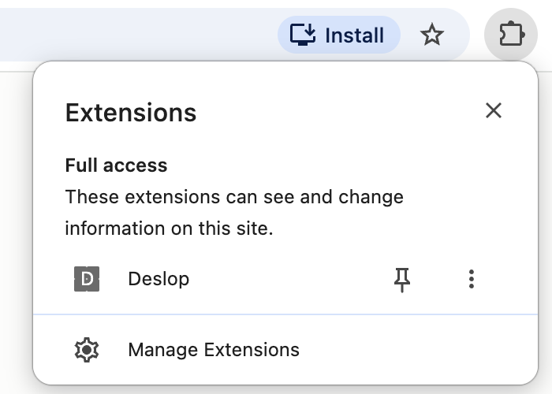
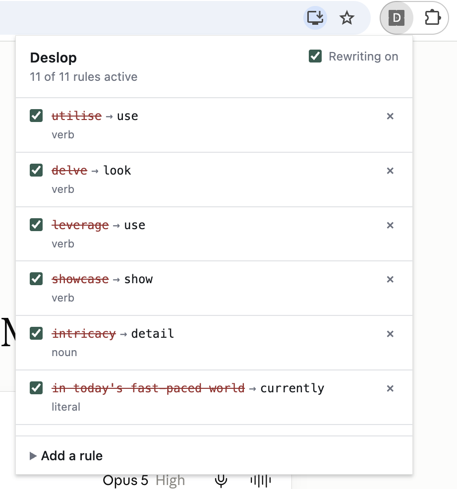
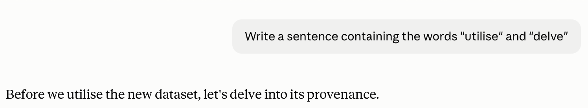
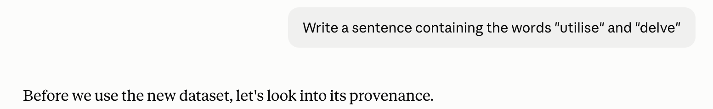

# Deslop: Make Claude's output nicer to read
This repository consists of two parts:

- a Rust crate which rewrites text based on user-defined rules
- a Chrome extension which intercepts LLM responses on claude.ai and sends it to the Rust code (compiled to WebAssembly)

## Overview
Claude's output can be unpleasant to read. This seems to be a widespread sentiment: see  [Simon Willison's LLM cliché highlighter](https://tools.simonwillison.net/llm-cliche-highlighter) or [this page about the "Load-bearing vocabulary of Claude"](https://louisabraham.github.io/load-bearing/).

The aim of this project is to let users author rules which will automatically rewrite Claude's output (specifically when using claude.ai in Google Chrome).

Three types of rules are supported:

- Literals: a literal string to be replaced by another, such as "rich tapestry of" by just "range of"
- Lemmas: capture the inflected forms of verbs and nouns using a single rule. For example, "utilise", "utilises", "utilised" are all forms of the same verb. You can author a rule to rewrite "utilise" to "use" and it will also rewrite "utilised" to "used".
- Templates: some of Claude's speech patterns follow the same structure, e.g. "It's not just {A}, it's {B}". You can author a rule to replace this with "It's {B}", regardless of the value of A or B.

The extension comes with a few defaults to get you started, see `extension/defaults.js`.

## Usage
To build the extension, run `build.sh`. Ensure you have Rust installed as well as `wasm-pack` (`cargo install wasm-pack`)

To install the extension:
1. In Google Chrome, go to `chrome://extensions/`
2. Select "Load unpacked"
3. Select the `extension` folder

Now, going to `claude.ai`, you should see the extension 

If you click on Deslop, you should see the UI appearing with default rules. 

To test it, here is me asking it to write a sentence that will need to be rewritten, with and without the extension:

No rewriting            | Rewriting 
:-------------------------:|:-------------------------:
 | 

## Code structure
- `build.sh`: A script to run the tests and build the extension as WebAssembly
- `engine/src`: The Rust crate for the rewriting. This does not rely on the extension. `set_rules_inner()` in `lib.rs` just expects JSON-serialised rules and can then compile them, after which `deslop()` can take an input string and rewrite it in accordance with the rules.
  - `book.rs` deals with serialisation of the relevant types
  - `compile.rs` 'compiles' authored rules to a format used for rewriting
  - `inflect.rs` covers (not exhaustively) inflections of lemmas, so expanding a base form to cover e.g. third-person, past tense, etc.
  - `rewrite.rs` contains the core logic of applying compiled rules to text
  - `rules.rs` contains some types and logic for parsing rules (especially template rules) and expanding lemmas into literal rules
  - `lib.rs` is the entry point for the crate
- `extension` contains the JavaScript and files necessary to make the extension work on claude.ai in Chrome
  - `defaults.js` contains some default rules
  - `deslop_engine.js` and `deslop_wasm.js` contain WebAssembly and call the Rust functions
  - `intercept.js` handles intercepting responses from Claude, chunking it sentence by sentence, and passing it to the rewriting engine
  - `manifest.json` is a standard file required for Chrome extensions to define its functionality, permissions, metadata
  - `popup.html` and `popup.js` contain the UI for the extension
  - `storage.js` handles storing and loading rules from browser storage

## Limitations and next steps
- There are lots of irregular nouns and verbs which are not covered by the current inflection rules. This is a work in progress.
- There are more rule types that could be supported
- The WebAssembly is currently inlined in the extension, which is a workaround and should be done properly.
- There are some arbitrary limitations, e.g. the `MAX_HOLD` parameter in `intercept.js`, or the fact that only up to three "holes" are allowed in template rules. This is done in the interest of getting something working
- The extension only works on `claude.ai` and is reliant on its current behaviour; interception is also not guaranteed to be perfect